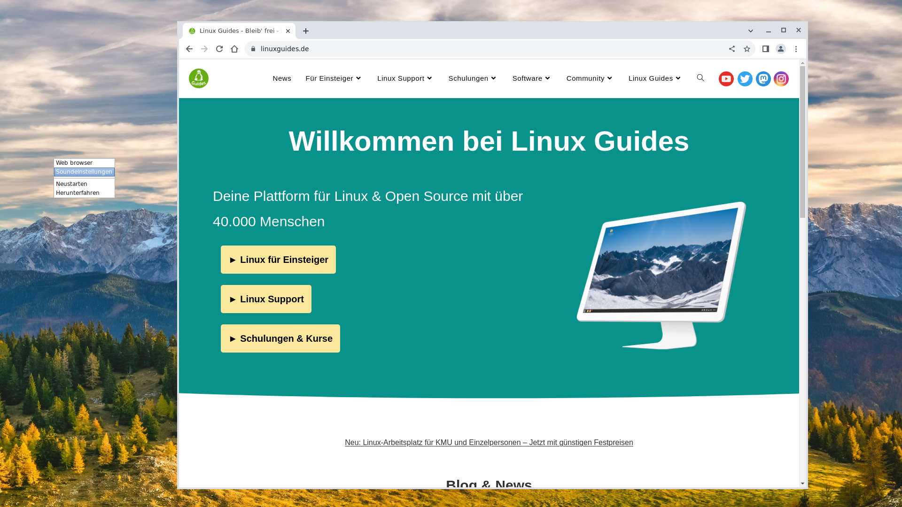

# minimalOS

Einfaches Linux für Kiosks oder sehr leichte Workstations, welches nahezu nur aus einem Chromium Browser besteht aber sich vollautomatisch aktualisiert und (fast) ausbruchsicher ist.



Gesteuert kann das System über einen Rechtsklick auf den Desktop, nachdem der Browser geschlossen wurde (Alt+F4).

Der Standard-Benutzer hat keine Root-Rechte und meldet sich vollautomatisch ohne Passworteingabe ein.
Um Root zu werden, muss man auf eine andere Konsole wechseln (Beispiel: Strg + Alt + F1) und sich dann als `root` einloggen. Das Passwort dafür kann in der `preseed.cfg` konfiguriert werden und ist standardmäßig `mei3eiN6`.

Drucker werden (soweit unterstützt) automatisch erkannt und können in Chromium unter "andere" ausgewählt werden. Das System untertützt ebenfalls Bildschirmeinstellungen sowie Soundeinstellungen über einen Rechtsklick auf den Desktop. Die Bildschirmeinstellung kann auch permanent in der unten genannten autostart-Datei hart konfiguriert werden.

**Achtung:** !Das System installiert sich vollautomatisch auf den Rechner und löscht standardmäßig alle Partitionen!

## Hardware Anforderungen

|     |  Leerlauf | Empfohlene Mindestanforderungen  |
|-----|-----------|----------------------------------|
| RAM | 340 MB    | 1 GB                             |
| Festplattenkapazität | 2.5 GB | 10 GB |

Unterstützte Architekturen: amd64, arm64, i386 (32bit)

## .iso-Datei bauen

- Unter `deb/usr/lib/minimal-os/openbox/autostart` können automatisch gestartete Anwendungen sowie ebenfalls der Link der Webseite, die sich standardmäßig öffnen sollen, definiert werden.
- Ebenfalls kann das Hintergrundbild `deb/usr/share/backgrounds/minimal-os.jpg` ausgetauscht werden.
- Außerdem kann das OpenBox Menü (Rechtsklick) unter `deb/usr/lib/minimal-os/menu.xml` angepasst werden. Standardmäßig ist das volle Applications-Menü deaktiviert.
- In der `preseed.cfg` Datei können Standard-Passwörter angepasst werden, weitere Software hinzugefügt werden (in der Zeile `d-i pkgsel/include string`), sowie die vollautomatische Installation unterbrochen werden.

```bash
git clone https://github.com/Jean28518/minimalOS.git
cd minimalOS
bash create-deb.sh
```

---

### amd64

Die "normale" Architektur

```bash
bash download-debian-amd64.sh
sudo bash build.sh amd
```

### arm64

Beispielsweise für den Raspberry Pi.

```bash
bash download-debian-arm64.sh
sudo bash build.sh arm
```

### i386

Für ältere 32bit Systeme.

```bash
bash download-debian-i386.sh
sudo bash build.sh 386
```

---

- Nun sollte eine minimalOS.iso Datei existieren, die wie jedes andere Linux vollautomatisch installiert werden kann. **Achtung: Das System formatiert (wenn nicht in der preseed-Datei auskommentiert) alle Festplatten auf dem System!**

## Weitere Anpassungen benötigt?

Melden Sie sich gerne unter <https://www.linuxguides.de/kontakt/> und wir helfen Ihnen gerne weiter!
